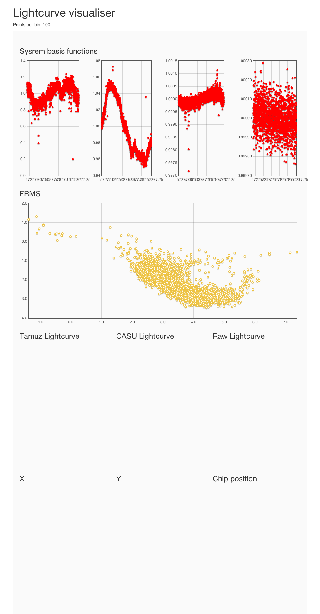
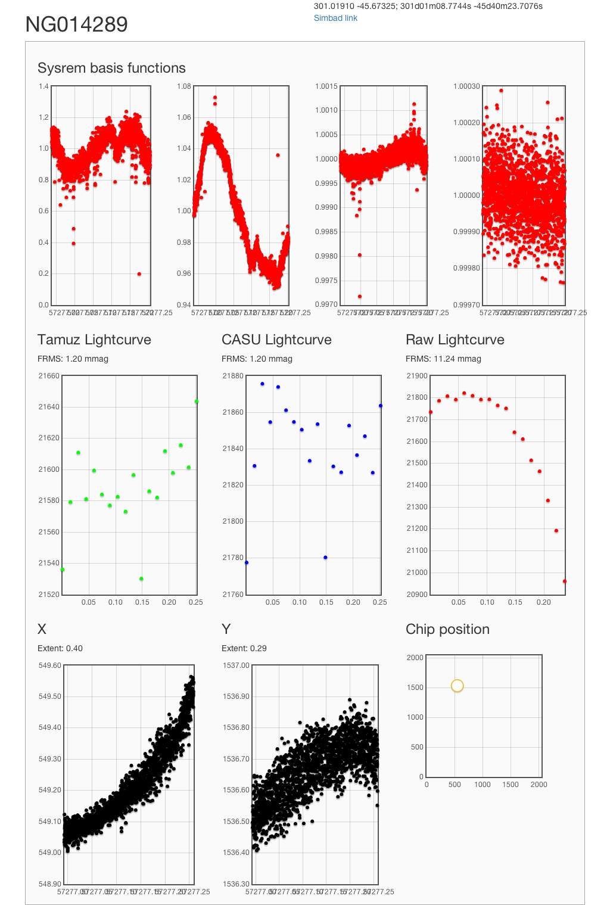

# Lightcurve explorer

This code allows easy exploration of NGTS lightcurves, by picking
objects from their bulk noise properties.

It is made of two components, the interactive web-based data viewer, and
an IPython session for data manipulation.

## Web viewer

### Usage

It runs a web server which listens on a specifiable port. You connect
your browser to this port, and the landing page opens:

The fractional rms plot (yellow points) can be clicked on, filling in
the empty lightcurve and coordinate plots. When this occurs the objects'
id appears near the top and is a link to the detail page, which shows
the same information but with a url that is fixed:

The url of this example page is `/view/14289`, matching the object id at
the top.

Also available are the objects coordinates, and a link to a simbad
search in the nearby area.

#### Running the server on `ngtshead`

As the software runs in the browser, the user must be able to connect to
the port the server is listening on. By default this is 5000, but this
can be configured by command line arguments.

1. [Forward your port](#port-forwarding)
1. Find the pipeline output file you wish to analyse
   * e.g. `/ngts/pipedev/ParanalOutput/nightly_data/20150909-ng2000-802-custom-flat-high-quality.fits`
1. Run the command: `bash /home/sw/work/NGTS/lightcurve-visualiser/run_from_anywhere.sh <data file> -b <bin number> -p <port>`

#### Running the server locally

The main server is written with [Flask](http://flask.pocoo.org/), and
requires:

* `flask`
* `fitsio`
* `numpy`
* `scipy`
* `astropy`

I recommend the [conda](http://conda.pydata.org/docs/) package manager. The javascript packages come from a CDN so do not need to be installed.

### Port forwarding

There are three methods for this. In approximate order of ease:

#### Forward on connection

In the ssh command used to get to `ngtshead`, add the following flag:

`-L 5000:localhost:5000`

This forwards port 5000 on the remote machine (the port that the server
is listening on) to `localhost:5000` i.e. on your local machine. If port
5000 is not available, for example if another user is hosting on port
5000 then an alternative *remote* port can be specified:

`-L 5001:localhost:5000`

This ports *remote* port 5001 to *local* port 5000.

#### Open another terminal

If you forget to forward the correct port when you ssh in to run the
server, another ssh session can be started, with the `-L` flag mentioned
in [Forward on connection](#forward-on-connection).

#### From inside an existing session

ssh understands a *magic* key combination which is a little tricky to
do. There must be a new line (so I usually mash enter about 5 times) and
press:

`~C`

This gives a little prompt `ssh> ` under your cursor and you can forward
ports from inside the active session. This control is running *outside*
your logged in shell so behaves a little strange, for example shell
history and tab completion do not work, and you must press escape to
leave.

In this shell you can then add a `-L` flag as per [Forward on
connection](#forward-on-connection).

## IPython session

Once an interesting object has been found, it is worth exploring in an
interactive python session. The script `get_long_lightcurves.py` opens
the main data file and extracts the useful data for the lightcurve. It
defines some handy helper functions and tools for binning, sigma
clipping and periodic searches.

**Please be sure you have read [the section on X
forwarding](#x-forwarding)!**

### Usage

Run the script `get_long_lightcurves.py` with the data file argument
(same as the web viewer) and `-a <aperture number>` e.g. 14289. This
launches an ipython session with a short help text on what variables are
available.

### Variables

* `hjd`
* `rawflux` (may be `None`)
* `tamflux`
* `casuflux` (may be `None`)
* `skybkg`
* `imagelist`
* `cat` (catalogue entry)
* `sc` (sigma clipped `tamflux`, 2 iterations)
* `nights` (list of nights)

### Functions

`bin`: function returning binned data. Supply the y values (e.g. flux)
    and (optionally) x values and a number of bins, and get back the
    binned x and binned y
`nightly`: generator, taking x and y data and the array of nights and
    yielding an (x/y) pair for each night
`nightly_bin`: return the binned nightly data
`nightly_average`: nightly normalised data
`period_fit`: create a `gatspy` model for finding periodic signals
    through Lomb Scargle. Supply the x, y and period range. See the
    [gatspy docs](http://www.astroml.org/gatspy/) for more information
`periodogram`: given a `gatspy` model, compute the period and power
    information for rendering a periodogram

### X forwarding

In a similar way that the server requires [port
forwarding](#port-forwarding), this interactive tool when run on a
remote machine requires X forwarding. This is achieved with the `-X`
flag to ssh, but *cannot* be set up from another terminal or through the
ssh magic key combination.
